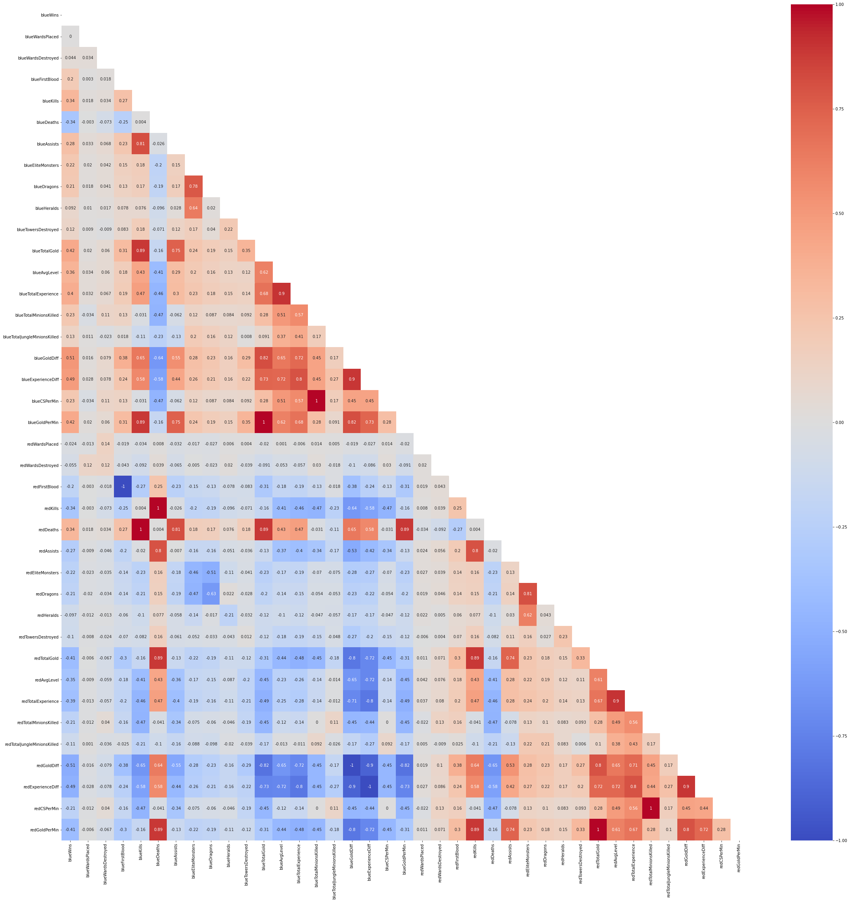
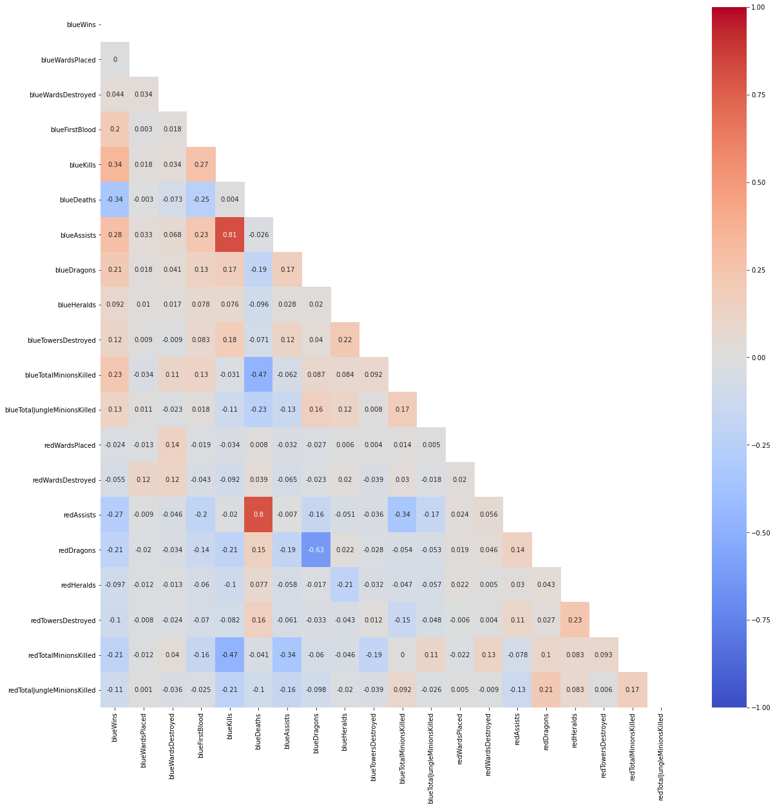

# Final Project Submission

* Student name: Jonathan Lee
* Student pace: Full Time
* Scheduled project review date/time: May 26, 2pm
* Instructor name: James Irving
* Blog post URL: https://github.com/ds-papes/dsc-phase-3-project

## TABLE OF CONTENTS 

*Click to jump to matching Markdown Header.*  
 
- **[Introduction](#INTRODUCTION) **
- **[OBTAIN](#OBTAIN)** 
- **[SCRUB](#SCRUB)** 
- **[EXPLORE](#EXPLORE)** 
- **[MODEL](#MODEL)** 
- **[iNTERPRET](#iNTERPRET)** 
- **[Conclusions/Recommendations](#CONCLUSIONS-&-RECOMMENDATIONS) **
___

# INTRODUCTION

## Business Problem

Just like in any traditional sports, there are multiple elements  eSports there are many different aspects of a match that contribute to the outcome of either a win or a loss. This analysis focuses on using various machine learning algorithms to create a model based on data collected within the first 10 minutes of a high-ranking League of Legends match which as accurately as possible predicts the outcome of the match. Based on the resulting models, we will identify what elements of the game have the highest impact on the outcome of a match, and how an eSports coach should plan his/her team's training program.

# OBTAIN

## Data Understanding

The data we will use to perform this analysis was obtained from [this](https://www.kaggle.com/bobbyscience/league-of-legends-diamond-ranked-games-10-min) Kaggle dataset which was obtained via the Riot API. It includes data from 9,879 high ranking (Diamond I to Master) competitive matches with 19 features per team and one target variable which indicates whether the match resulted in a win for the blue team.

<b>Glossary of Features:</b>

- Ward: An item that players can place on the map to reveal the nearby area. Very useful for map/objectives control.
- Assist: Awards partial gold and experience points when damage is done to contribute to an enemy's death.
- Elite Monsters: Monsters with high hp/damage that give a massive bonus (gold/XP/stats) when killed by a team.
- Dragon: AKA Drake. This powerful neutral monster grants various permanent effects and buffs when when killed by a team.
- Herald: A monster that spawns on the eigth minute. Grants a buff that allows the user to spawn the Herald for your team to help push towers and lanes.
- Tower: A structure that blocks the enemy’s path to the base. They take high damage and fire at opponents within a certain radius.
- Gold: Currency awarded for killing monsters or enemy players as well as for completing objectives.
- Level: Champion level. Start at 1. Max is 18.
- Minions: Non-player characters (NPCs) that spawn from each team’s base.
- Jungle Minions: NPC that belong to NO TEAM. They give gold and temporary buffs when killed by players.

We have all numerical data and fortunately no null values to address. However, we have more columns than the default display allows us to see, so we will adjust the pandas display option. 

## Data Preparation

Since this dataset was collected via Riot's API, we will trust that the data is accurate and not perform any outlier removal. Another reason for including outliers in our analysis is to consider whether outliers in certain features have an impact on the outcome of a match. We also do not have any null values to address, and so we will use this stage of the analysis to create different versions of this dataset using different features to examine whether we can obtain different results during the modeling process.

The two different datasets we will prepare are as follows:
- df_big: Unaltered dataframe with all original features included.
- df_select: Altered dataframe with aggregate columns removed and only controllable features included.

# EXPLORE

At this stage, we will examine if there are any redundant features in our two datasets and if there is any high multicollinearity that we might need to address.

TotalExperience and TotalGold are both features that are aggregates of the other columns, so we will explore some visualizations to determine whether we can expect a correlation with our target variable.

    

    

We can see that there are multiple features that have high multicollinearity. This is a big problem when considering a logistic regression, and so we will avoid using df_big for our logistic regression model.

Even though multicollinearity is not as much of an issue in df_select, we still have some features with perfect multicollinearity: redFirstBlood, redKills, and redDeaths. These features are perfect inverses of blueFirstBlood, blueDeaths, and blueKills respectively, and so we will go ahead and remove those columns to prepare our dataset for logistic regression. The resulting correlatinon matrix is shown below.

    

    

Although redAssists and blueAssists do have some with blueDeaths and blueKills respectively, we will leave those features in our dataframe since the correlation coefficients are not too high, and the impact of assists on the match outcome is still important to our analysis.

Next, we will examine the general distribution how the total experience and gold are correlated with our target variable in addition to their distributions and outliers.

### Visualization for blueTotalExperience vs blueWins.

    

    

### Visualization for redTotalExperience vs blueWins.

    

    

### Visualization for blueTotalGold vs blueWins.

    

    

### Visualization for redTotalGold vs blueWins.

    

    

Again, we can see that we do have a lot of outliers, but the distribution of each of these features is normal. As you might have expected, we can see a generally negative correlation between red total gold and experience and a blue win, with a generally positive correlation between blue total gold and experience and a blue win.

# MODEL

## Data Modeling
Now that we have seen that there is some relationship between the total experience and gold and a team's win, we want to dive deeper into creating a model that puts together our features to as accurately as possible predict the outcome of a match and to identify which features have the highest impact on the match outcome.

In this section, we will cover the following three model types:
1. Logistic Regression
2. Random Forest
3. XGBoost: Random Forest

Logistic Regression will be the least computationally costly model, and so we will use this as a baseline to compare our other models and determine whether there is any value to using more complex models.

We will then move onto Random Forest and XGBoost models to see whether an ensemble method might provide a better predictive model, while also keeping in consideration the issue of overfitting.

For our Logistic Regression model, we will only use df_select since we have addressed the issue of multicollinearity specifically for this model. For our ensemble methods, we will pass through both df_select and df_big to determine whether a collection of all features provides us with better predictive ability than when we include only a subset of features.

## Logistic Regression
Below, we can see our evaluation metrics for our Logistic Regression Classifier.

    ****CLASSIFICATION REPORT - TRAINING DATA****
                  precision    recall  f1-score   support
    
               0     0.7215    0.7190    0.7202      3690
               1     0.7221    0.7247    0.7234      3719
    
        accuracy                         0.7218      7409
       macro avg     0.7218    0.7218    0.7218      7409
    weighted avg     0.7218    0.7218    0.7218      7409
    
    ****CLASSIFICATION REPORT - TEST DATA****
                  precision    recall  f1-score   support
    
               0     0.7313    0.7307    0.7310      1259
               1     0.7203    0.7209    0.7206      1211
    
        accuracy                         0.7259      2470
       macro avg     0.7258    0.7258    0.7258      2470
    weighted avg     0.7259    0.7259    0.7259      2470
    
    ****CONFUSION MATRIX AND ROC-AUC VISUALIZATION****

    

    

Not a bad starting point! We can see that our macro recall score is 0.7193 on the training data, on our test data received a macro recall score of 0.7278, meaning that of the true wins and losses, our Logistic Regression model is predicting 72.78% of them correctly. We also do not have an issue of under or overfitting.

## GridSearch CV - XGBoost: Random Forest

Below, we have the results from a gridsearch being run on our XGBoost model. Since we had a better score on df_big where we left our features unaltered, we will proceed with that dataframe.

    ****CLASSIFICATION REPORT - TRAINING DATA****
                  precision    recall  f1-score   support
    
               0     0.7479    0.7704    0.7590      3697
               1     0.7642    0.7414    0.7526      3712
    
        accuracy                         0.7558      7409
       macro avg     0.7561    0.7559    0.7558      7409
    weighted avg     0.7561    0.7558    0.7558      7409
    
    ****CLASSIFICATION REPORT - TEST DATA****
                  precision    recall  f1-score   support
    
               0     0.7282    0.7468    0.7374      1252
               1     0.7327    0.7135    0.7230      1218
    
        accuracy                         0.7304      2470
       macro avg     0.7305    0.7301    0.7302      2470
    weighted avg     0.7304    0.7304    0.7303      2470
    
    ****CONFUSION MATRIX AND ROC-AUC VISUALIZATION****

    

    

    ****MODEL PARAMETERS****

<table border="1" class="dataframe">
  <thead>
    <tr style="text-align: right;">
      <th></th>
      <th>parameters</th>
    </tr>
  </thead>
  <tbody>
    <tr>
      <th>colsample_bynode</th>
      <td>0.8</td>
    </tr>
    <tr>
      <th>learning_rate</th>
      <td>0.03</td>
    </tr>
    <tr>
      <th>reg_lambda</th>
      <td>1e-05</td>
    </tr>
    <tr>
      <th>subsample</th>
      <td>0.4</td>
    </tr>
    <tr>
      <th>objective</th>
      <td>binary:logistic</td>
    </tr>
    <tr>
      <th>base_score</th>
      <td>0.5</td>
    </tr>
    <tr>
      <th>booster</th>
      <td>gbtree</td>
    </tr>
    <tr>
      <th>colsample_bylevel</th>
      <td>1</td>
    </tr>
    <tr>
      <th>colsample_bytree</th>
      <td>1</td>
    </tr>
    <tr>
      <th>gamma</th>
      <td>0</td>
    </tr>
    <tr>
      <th>gpu_id</th>
      <td>-1</td>
    </tr>
    <tr>
      <th>importance_type</th>
      <td>gain</td>
    </tr>
    <tr>
      <th>interaction_constraints</th>
      <td></td>
    </tr>
    <tr>
      <th>max_delta_step</th>
      <td>0</td>
    </tr>
    <tr>
      <th>max_depth</th>
      <td>6</td>
    </tr>
    <tr>
      <th>min_child_weight</th>
      <td>4</td>
    </tr>
    <tr>
      <th>missing</th>
      <td>NaN</td>
    </tr>
    <tr>
      <th>monotone_constraints</th>
      <td>()</td>
    </tr>
    <tr>
      <th>n_estimators</th>
      <td>100</td>
    </tr>
    <tr>
      <th>n_jobs</th>
      <td>0</td>
    </tr>
    <tr>
      <th>num_parallel_tree</th>
      <td>100</td>
    </tr>
    <tr>
      <th>random_state</th>
      <td>42</td>
    </tr>
    <tr>
      <th>reg_alpha</th>
      <td>0</td>
    </tr>
    <tr>
      <th>scale_pos_weight</th>
      <td>1</td>
    </tr>
    <tr>
      <th>tree_method</th>
      <td>exact</td>
    </tr>
    <tr>
      <th>validate_parameters</th>
      <td>1</td>
    </tr>
    <tr>
      <th>verbosity</th>
      <td>None</td>
    </tr>
  </tbody>
</table>

We see an improvement in our recall score by 0.05% which is tiny, but let's see if we can tune our hyperparameters a bit further.

We can see that with a macro recall score of 0.7319 on the testing data, this seems to be the model with the best predictive ability! We can also see that the score on the training data is 0.7495, showing that we do not have an issue of under or overfitting.

# iNTERPRET

We started with a macro recall score of 0.7210 in our baseline Logistic Regression model, and through trying different modeling algorithms in combination with gridsearches, we were able to increase our macro recall score to 0.7319. This means that our final Logistic Regression model is capable of correctly identifying 72.26% of wins or losses based on the data collected within the first 10 minutes of each match, while our XGBoost model is able to correctly identify 73.19%.

Using our final Logistic Regression and XGBoost models, we can now extract the feature coefficients and importances in order to identify how much impact each of the elements of the game are likely to have on the outcome of each match. Although the model with the best predictive ability was our gridsearched XGBoost, we will proceed to explain feature importance with the Logistic Regression that was run on df_select in order to preserve interpretability of our values.

Based on these findings, we will be able to provide out final recommendations as to what our eSports coach should focus on while creating a training program for his/her team.

    

    

Our bar plot indicates that champion kills and deaths within the first 10 minutes of the match have by far the most impact on the outcome of a match. We can see that total lane minions and total jungle creeps and dragons are also of high importance. Surprisingly, Heralds, vision wards, and towers are of least importance.

Because our displayed units are in odds, we can see that 1 standard deviation increase in each of the above features will result in the corresponding percent increase or decrease in the odds of winning.

    

    

We can see that there is a difference of approximately 10 in the number of total minions killed at the 10 minute mark that would make the difference between a loss and a win. In order to maximize our chances of winning, we want to make sure that the team reaches a total minion kill count of above 222 within 10 minutes of the match start.

    

    

Although the difference in the total number of jungle creeps killed between losses and wins is smaller than we saw in the difference in lane minion kills, we want to make sure to have our jungler is able to clear more than 52 jungle creeps in order to maximize the odds of winning.

# CONCLUSIONS & RECOMMENDATIONS

Based on the above findings, we can see that champion kills and assists, lane minions, jungle minions, and dragons have the highest impact on the outcome of a high ranking League of Legends match.

My primary recommendation would be to focus heavily on the Jungler role. While optimizing an efficient jungle clearing path to maximize the number of jungle creeps killed, we want to make sure to capitalize on any early champion kills that might be possible if the Jungler can execute an effective gank.

My secondary recommendation would be to have all laners heavily drill last hitting minions to maximize the number of minion kills in the early stages of the match. There are a total of 107 minions that spawn per lane within the first 10 minutes of the match, and we want to aim for a team total of 222 minions or more. This means that each laner must kill at least 74 minions, while avoiding death and if possible, securing champion kills.

Lastly, since dragons are also of high importance, the Support role should place vision wards close to the dragon pit in order to maintain map control in that area, while the AD Carry role focuses on securing minions kills within his/her lane.

Some considerations for further analysis would include:
1. Whether we can find additional features outside of the scope of the selected dataset to improve the predictive capability of our models.
2. Analyzing data collected at the end of each match to identify what elements of the game led to a quicker vs. slower victory so that we can adjust the team strategy mid-game to increase the odds of winning.
3. Collect data on the specific eSports team's actual performance to identify what areas need to be targeted.

