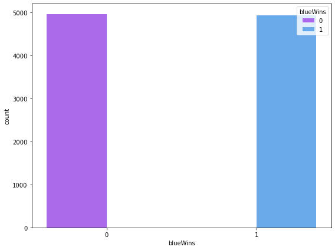
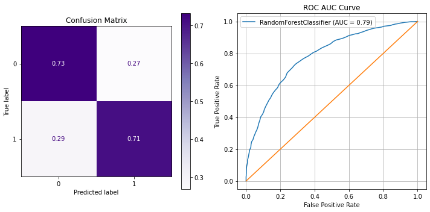

# Final Project Submission

* Student name: Jonathan Lee
* Student pace: Full Time
* Scheduled project review date/time: May 26, 2pm
* Instructor name: James Irving
* Blog post URL: https://github.com/ds-papes/dsc-phase-3-project

## TABLE OF CONTENTS 

*Click to jump to matching Markdown Header.*<br><br>
 
- **[Introduction](#INTRODUCTION)<br>**
- **[OBTAIN](#OBTAIN)**<br>
- **[SCRUB](#SCRUB)**<br>
- **[EXPLORE](#EXPLORE)**<br>
- **[MODEL](#MODEL)**<br>
- **[iNTERPRET](#iNTERPRET)**<br>
- **[Conclusions/Recommendations](#CONCLUSIONS-&-RECOMMENDATIONS)<br>**
___

# INTRODUCTION

## Business Problem

Just like in any traditional sports, there are multiple elements  eSports there are many different aspects of a match that contribute to the outcome of either a win or a loss. This analysis focuses on using various machine learning algorithms to create a model based on data collected within the first 10 minutes of a high-ranking League of Legends match which as accurately as possible predicts the outcome of the match. Based on the resulting models, we will identify what elements of the game have the highest impact on the outcome of a match, and how an eSports coach should plan his/her team's training program.

# OBTAIN

## Data Understanding

The data we will use to perform this analysis was obtained from [this](https://www.kaggle.com/bobbyscience/league-of-legends-diamond-ranked-games-10-min) Kaggle dataset which was obtained via the Riot API. It includes data from 9,879 high ranking (Diamond I to Master) competitive matches with 19 features per team and one target variable which indicates whether the match resulted in a win for the blue team.

<b>Glossary of Features:</b>

- Ward: An item that players can place on the map to reveal the nearby area. Very useful for map/objectives control.
- Assist: Awards partial gold and experience points when damage is done to contribute to an enemy's death.
- Elite Monsters: Monsters with high hp/damage that give a massive bonus (gold/XP/stats) when killed by a team.
- Dragon: AKA Drake. This powerful neutral monster grants various permanent effects and buffs when when killed by a team.
- Herald: A monster that spawns on the eigth minute. Grants a buff that allows the user to spawn the Herald for your team to help push towers and lanes.
- Tower: A structure that blocks the enemy’s path to the base. They take high damage and fire at opponents within a certain radius.
- Gold: Currency awarded for killing monsters or enemy players as well as for completing objectives.
- Level: Champion level. Start at 1. Max is 18.
- Minions: Non-player characters (NPCs) that spawn from each team’s base.
- Jungle Minions: NPC that belong to NO TEAM. They give gold and temporary buffs when killed by players.


```python
# Import packages to be used in notebook.
import pandas as pd
import numpy as np
import seaborn as sns

import matplotlib.pyplot as plt
from matplotlib.gridspec import GridSpec

from sklearn.model_selection import train_test_split, GridSearchCV
from sklearn.preprocessing import StandardScaler
from sklearn.linear_model import LogisticRegression, LogisticRegressionCV
from sklearn.ensemble import RandomForestClassifier
from sklearn import metrics 

from xgboost import XGBRFClassifier, XGBClassifier

import warnings
warnings.filterwarnings('ignore')

%matplotlib inline
```


```python
# Load data and display basic info.
df = pd.read_csv('data/high_diamond_ranked_10min.csv')
display(df.head(5), df.info())
```

    <class 'pandas.core.frame.DataFrame'>
    RangeIndex: 9879 entries, 0 to 9878
    Data columns (total 40 columns):
     #   Column                        Non-Null Count  Dtype  
    ---  ------                        --------------  -----  
     0   gameId                        9879 non-null   int64  
     1   blueWins                      9879 non-null   int64  
     2   blueWardsPlaced               9879 non-null   int64  
     3   blueWardsDestroyed            9879 non-null   int64  
     4   blueFirstBlood                9879 non-null   int64  
     5   blueKills                     9879 non-null   int64  
     6   blueDeaths                    9879 non-null   int64  
     7   blueAssists                   9879 non-null   int64  
     8   blueEliteMonsters             9879 non-null   int64  
     9   blueDragons                   9879 non-null   int64  
     10  blueHeralds                   9879 non-null   int64  
     11  blueTowersDestroyed           9879 non-null   int64  
     12  blueTotalGold                 9879 non-null   int64  
     13  blueAvgLevel                  9879 non-null   float64
     14  blueTotalExperience           9879 non-null   int64  
     15  blueTotalMinionsKilled        9879 non-null   int64  
     16  blueTotalJungleMinionsKilled  9879 non-null   int64  
     17  blueGoldDiff                  9879 non-null   int64  
     18  blueExperienceDiff            9879 non-null   int64  
     19  blueCSPerMin                  9879 non-null   float64
     20  blueGoldPerMin                9879 non-null   float64
     21  redWardsPlaced                9879 non-null   int64  
     22  redWardsDestroyed             9879 non-null   int64  
     23  redFirstBlood                 9879 non-null   int64  
     24  redKills                      9879 non-null   int64  
     25  redDeaths                     9879 non-null   int64  
     26  redAssists                    9879 non-null   int64  
     27  redEliteMonsters              9879 non-null   int64  
     28  redDragons                    9879 non-null   int64  
     29  redHeralds                    9879 non-null   int64  
     30  redTowersDestroyed            9879 non-null   int64  
     31  redTotalGold                  9879 non-null   int64  
     32  redAvgLevel                   9879 non-null   float64
     33  redTotalExperience            9879 non-null   int64  
     34  redTotalMinionsKilled         9879 non-null   int64  
     35  redTotalJungleMinionsKilled   9879 non-null   int64  
     36  redGoldDiff                   9879 non-null   int64  
     37  redExperienceDiff             9879 non-null   int64  
     38  redCSPerMin                   9879 non-null   float64
     39  redGoldPerMin                 9879 non-null   float64
    dtypes: float64(6), int64(34)
    memory usage: 3.0 MB


<div>
<style scoped>
    .dataframe tbody tr th:only-of-type {
        vertical-align: middle;
    }

    .dataframe tbody tr th {
        vertical-align: top;
    }

    .dataframe thead th {
        text-align: right;
    }
</style>
<table border="1" class="dataframe">
  <thead>
    <tr style="text-align: right;">
      <th></th>
      <th>gameId</th>
      <th>blueWins</th>
      <th>blueWardsPlaced</th>
      <th>blueWardsDestroyed</th>
      <th>blueFirstBlood</th>
      <th>blueKills</th>
      <th>blueDeaths</th>
      <th>blueAssists</th>
      <th>blueEliteMonsters</th>
      <th>blueDragons</th>
      <th>...</th>
      <th>redTowersDestroyed</th>
      <th>redTotalGold</th>
      <th>redAvgLevel</th>
      <th>redTotalExperience</th>
      <th>redTotalMinionsKilled</th>
      <th>redTotalJungleMinionsKilled</th>
      <th>redGoldDiff</th>
      <th>redExperienceDiff</th>
      <th>redCSPerMin</th>
      <th>redGoldPerMin</th>
    </tr>
  </thead>
  <tbody>
    <tr>
      <th>0</th>
      <td>4519157822</td>
      <td>0</td>
      <td>28</td>
      <td>2</td>
      <td>1</td>
      <td>9</td>
      <td>6</td>
      <td>11</td>
      <td>0</td>
      <td>0</td>
      <td>...</td>
      <td>0</td>
      <td>16567</td>
      <td>6.8</td>
      <td>17047</td>
      <td>197</td>
      <td>55</td>
      <td>-643</td>
      <td>8</td>
      <td>19.7</td>
      <td>1656.7</td>
    </tr>
    <tr>
      <th>1</th>
      <td>4523371949</td>
      <td>0</td>
      <td>12</td>
      <td>1</td>
      <td>0</td>
      <td>5</td>
      <td>5</td>
      <td>5</td>
      <td>0</td>
      <td>0</td>
      <td>...</td>
      <td>1</td>
      <td>17620</td>
      <td>6.8</td>
      <td>17438</td>
      <td>240</td>
      <td>52</td>
      <td>2908</td>
      <td>1173</td>
      <td>24.0</td>
      <td>1762.0</td>
    </tr>
    <tr>
      <th>2</th>
      <td>4521474530</td>
      <td>0</td>
      <td>15</td>
      <td>0</td>
      <td>0</td>
      <td>7</td>
      <td>11</td>
      <td>4</td>
      <td>1</td>
      <td>1</td>
      <td>...</td>
      <td>0</td>
      <td>17285</td>
      <td>6.8</td>
      <td>17254</td>
      <td>203</td>
      <td>28</td>
      <td>1172</td>
      <td>1033</td>
      <td>20.3</td>
      <td>1728.5</td>
    </tr>
    <tr>
      <th>3</th>
      <td>4524384067</td>
      <td>0</td>
      <td>43</td>
      <td>1</td>
      <td>0</td>
      <td>4</td>
      <td>5</td>
      <td>5</td>
      <td>1</td>
      <td>0</td>
      <td>...</td>
      <td>0</td>
      <td>16478</td>
      <td>7.0</td>
      <td>17961</td>
      <td>235</td>
      <td>47</td>
      <td>1321</td>
      <td>7</td>
      <td>23.5</td>
      <td>1647.8</td>
    </tr>
    <tr>
      <th>4</th>
      <td>4436033771</td>
      <td>0</td>
      <td>75</td>
      <td>4</td>
      <td>0</td>
      <td>6</td>
      <td>6</td>
      <td>6</td>
      <td>0</td>
      <td>0</td>
      <td>...</td>
      <td>0</td>
      <td>17404</td>
      <td>7.0</td>
      <td>18313</td>
      <td>225</td>
      <td>67</td>
      <td>1004</td>
      <td>-230</td>
      <td>22.5</td>
      <td>1740.4</td>
    </tr>
  </tbody>
</table>
<p>5 rows × 40 columns</p>
</div>


    None


We have all numerical data and fortunately no null values to address. However, we have more columns than the default display allows us to see, so we will adjust the pandas display option. 


```python
# Set maximum number of columns displayed to 40.
pd.set_option('display.max_columns', 40)
df.head()
```


<div>
<style scoped>
    .dataframe tbody tr th:only-of-type {
        vertical-align: middle;
    }

    .dataframe tbody tr th {
        vertical-align: top;
    }

    .dataframe thead th {
        text-align: right;
    }
</style>
<table border="1" class="dataframe">
  <thead>
    <tr style="text-align: right;">
      <th></th>
      <th>gameId</th>
      <th>blueWins</th>
      <th>blueWardsPlaced</th>
      <th>blueWardsDestroyed</th>
      <th>blueFirstBlood</th>
      <th>blueKills</th>
      <th>blueDeaths</th>
      <th>blueAssists</th>
      <th>blueEliteMonsters</th>
      <th>blueDragons</th>
      <th>blueHeralds</th>
      <th>blueTowersDestroyed</th>
      <th>blueTotalGold</th>
      <th>blueAvgLevel</th>
      <th>blueTotalExperience</th>
      <th>blueTotalMinionsKilled</th>
      <th>blueTotalJungleMinionsKilled</th>
      <th>blueGoldDiff</th>
      <th>blueExperienceDiff</th>
      <th>blueCSPerMin</th>
      <th>blueGoldPerMin</th>
      <th>redWardsPlaced</th>
      <th>redWardsDestroyed</th>
      <th>redFirstBlood</th>
      <th>redKills</th>
      <th>redDeaths</th>
      <th>redAssists</th>
      <th>redEliteMonsters</th>
      <th>redDragons</th>
      <th>redHeralds</th>
      <th>redTowersDestroyed</th>
      <th>redTotalGold</th>
      <th>redAvgLevel</th>
      <th>redTotalExperience</th>
      <th>redTotalMinionsKilled</th>
      <th>redTotalJungleMinionsKilled</th>
      <th>redGoldDiff</th>
      <th>redExperienceDiff</th>
      <th>redCSPerMin</th>
      <th>redGoldPerMin</th>
    </tr>
  </thead>
  <tbody>
    <tr>
      <th>0</th>
      <td>4519157822</td>
      <td>0</td>
      <td>28</td>
      <td>2</td>
      <td>1</td>
      <td>9</td>
      <td>6</td>
      <td>11</td>
      <td>0</td>
      <td>0</td>
      <td>0</td>
      <td>0</td>
      <td>17210</td>
      <td>6.6</td>
      <td>17039</td>
      <td>195</td>
      <td>36</td>
      <td>643</td>
      <td>-8</td>
      <td>19.5</td>
      <td>1721.0</td>
      <td>15</td>
      <td>6</td>
      <td>0</td>
      <td>6</td>
      <td>9</td>
      <td>8</td>
      <td>0</td>
      <td>0</td>
      <td>0</td>
      <td>0</td>
      <td>16567</td>
      <td>6.8</td>
      <td>17047</td>
      <td>197</td>
      <td>55</td>
      <td>-643</td>
      <td>8</td>
      <td>19.7</td>
      <td>1656.7</td>
    </tr>
    <tr>
      <th>1</th>
      <td>4523371949</td>
      <td>0</td>
      <td>12</td>
      <td>1</td>
      <td>0</td>
      <td>5</td>
      <td>5</td>
      <td>5</td>
      <td>0</td>
      <td>0</td>
      <td>0</td>
      <td>0</td>
      <td>14712</td>
      <td>6.6</td>
      <td>16265</td>
      <td>174</td>
      <td>43</td>
      <td>-2908</td>
      <td>-1173</td>
      <td>17.4</td>
      <td>1471.2</td>
      <td>12</td>
      <td>1</td>
      <td>1</td>
      <td>5</td>
      <td>5</td>
      <td>2</td>
      <td>2</td>
      <td>1</td>
      <td>1</td>
      <td>1</td>
      <td>17620</td>
      <td>6.8</td>
      <td>17438</td>
      <td>240</td>
      <td>52</td>
      <td>2908</td>
      <td>1173</td>
      <td>24.0</td>
      <td>1762.0</td>
    </tr>
    <tr>
      <th>2</th>
      <td>4521474530</td>
      <td>0</td>
      <td>15</td>
      <td>0</td>
      <td>0</td>
      <td>7</td>
      <td>11</td>
      <td>4</td>
      <td>1</td>
      <td>1</td>
      <td>0</td>
      <td>0</td>
      <td>16113</td>
      <td>6.4</td>
      <td>16221</td>
      <td>186</td>
      <td>46</td>
      <td>-1172</td>
      <td>-1033</td>
      <td>18.6</td>
      <td>1611.3</td>
      <td>15</td>
      <td>3</td>
      <td>1</td>
      <td>11</td>
      <td>7</td>
      <td>14</td>
      <td>0</td>
      <td>0</td>
      <td>0</td>
      <td>0</td>
      <td>17285</td>
      <td>6.8</td>
      <td>17254</td>
      <td>203</td>
      <td>28</td>
      <td>1172</td>
      <td>1033</td>
      <td>20.3</td>
      <td>1728.5</td>
    </tr>
    <tr>
      <th>3</th>
      <td>4524384067</td>
      <td>0</td>
      <td>43</td>
      <td>1</td>
      <td>0</td>
      <td>4</td>
      <td>5</td>
      <td>5</td>
      <td>1</td>
      <td>0</td>
      <td>1</td>
      <td>0</td>
      <td>15157</td>
      <td>7.0</td>
      <td>17954</td>
      <td>201</td>
      <td>55</td>
      <td>-1321</td>
      <td>-7</td>
      <td>20.1</td>
      <td>1515.7</td>
      <td>15</td>
      <td>2</td>
      <td>1</td>
      <td>5</td>
      <td>4</td>
      <td>10</td>
      <td>0</td>
      <td>0</td>
      <td>0</td>
      <td>0</td>
      <td>16478</td>
      <td>7.0</td>
      <td>17961</td>
      <td>235</td>
      <td>47</td>
      <td>1321</td>
      <td>7</td>
      <td>23.5</td>
      <td>1647.8</td>
    </tr>
    <tr>
      <th>4</th>
      <td>4436033771</td>
      <td>0</td>
      <td>75</td>
      <td>4</td>
      <td>0</td>
      <td>6</td>
      <td>6</td>
      <td>6</td>
      <td>0</td>
      <td>0</td>
      <td>0</td>
      <td>0</td>
      <td>16400</td>
      <td>7.0</td>
      <td>18543</td>
      <td>210</td>
      <td>57</td>
      <td>-1004</td>
      <td>230</td>
      <td>21.0</td>
      <td>1640.0</td>
      <td>17</td>
      <td>2</td>
      <td>1</td>
      <td>6</td>
      <td>6</td>
      <td>7</td>
      <td>1</td>
      <td>1</td>
      <td>0</td>
      <td>0</td>
      <td>17404</td>
      <td>7.0</td>
      <td>18313</td>
      <td>225</td>
      <td>67</td>
      <td>1004</td>
      <td>-230</td>
      <td>22.5</td>
      <td>1740.4</td>
    </tr>
  </tbody>
</table>
</div>


# SCRUB

## Data Preparation

Since this dataset was collected via Riot's API, we will trust that the data is accurate and not perform any outlier removal. Another reason for including outliers in our analysis is to consider whether outliers in certain features have an impact on the outcome of a match. We also do not have any null values to address, and so we will use this stage of the analysis to create different versions of this dataset using different features to examine whether we can obtain different results during the modeling process.

The two different datasets we will prepare are as follows:
- df_big: Unaltered dataframe with all original features included.
- df_select: Altered dataframe with aggregate columns removed and only controllable features included.


```python
# Drop gameId column, since this is simply an identifier for each match
# and should not be included as part of our models.
df.drop('gameId', axis=1, inplace=True)
df.head()
```


<div>
<style scoped>
    .dataframe tbody tr th:only-of-type {
        vertical-align: middle;
    }

    .dataframe tbody tr th {
        vertical-align: top;
    }

    .dataframe thead th {
        text-align: right;
    }
</style>
<table border="1" class="dataframe">
  <thead>
    <tr style="text-align: right;">
      <th></th>
      <th>blueWins</th>
      <th>blueWardsPlaced</th>
      <th>blueWardsDestroyed</th>
      <th>blueFirstBlood</th>
      <th>blueKills</th>
      <th>blueDeaths</th>
      <th>blueAssists</th>
      <th>blueEliteMonsters</th>
      <th>blueDragons</th>
      <th>blueHeralds</th>
      <th>blueTowersDestroyed</th>
      <th>blueTotalGold</th>
      <th>blueAvgLevel</th>
      <th>blueTotalExperience</th>
      <th>blueTotalMinionsKilled</th>
      <th>blueTotalJungleMinionsKilled</th>
      <th>blueGoldDiff</th>
      <th>blueExperienceDiff</th>
      <th>blueCSPerMin</th>
      <th>blueGoldPerMin</th>
      <th>redWardsPlaced</th>
      <th>redWardsDestroyed</th>
      <th>redFirstBlood</th>
      <th>redKills</th>
      <th>redDeaths</th>
      <th>redAssists</th>
      <th>redEliteMonsters</th>
      <th>redDragons</th>
      <th>redHeralds</th>
      <th>redTowersDestroyed</th>
      <th>redTotalGold</th>
      <th>redAvgLevel</th>
      <th>redTotalExperience</th>
      <th>redTotalMinionsKilled</th>
      <th>redTotalJungleMinionsKilled</th>
      <th>redGoldDiff</th>
      <th>redExperienceDiff</th>
      <th>redCSPerMin</th>
      <th>redGoldPerMin</th>
    </tr>
  </thead>
  <tbody>
    <tr>
      <th>0</th>
      <td>0</td>
      <td>28</td>
      <td>2</td>
      <td>1</td>
      <td>9</td>
      <td>6</td>
      <td>11</td>
      <td>0</td>
      <td>0</td>
      <td>0</td>
      <td>0</td>
      <td>17210</td>
      <td>6.6</td>
      <td>17039</td>
      <td>195</td>
      <td>36</td>
      <td>643</td>
      <td>-8</td>
      <td>19.5</td>
      <td>1721.0</td>
      <td>15</td>
      <td>6</td>
      <td>0</td>
      <td>6</td>
      <td>9</td>
      <td>8</td>
      <td>0</td>
      <td>0</td>
      <td>0</td>
      <td>0</td>
      <td>16567</td>
      <td>6.8</td>
      <td>17047</td>
      <td>197</td>
      <td>55</td>
      <td>-643</td>
      <td>8</td>
      <td>19.7</td>
      <td>1656.7</td>
    </tr>
    <tr>
      <th>1</th>
      <td>0</td>
      <td>12</td>
      <td>1</td>
      <td>0</td>
      <td>5</td>
      <td>5</td>
      <td>5</td>
      <td>0</td>
      <td>0</td>
      <td>0</td>
      <td>0</td>
      <td>14712</td>
      <td>6.6</td>
      <td>16265</td>
      <td>174</td>
      <td>43</td>
      <td>-2908</td>
      <td>-1173</td>
      <td>17.4</td>
      <td>1471.2</td>
      <td>12</td>
      <td>1</td>
      <td>1</td>
      <td>5</td>
      <td>5</td>
      <td>2</td>
      <td>2</td>
      <td>1</td>
      <td>1</td>
      <td>1</td>
      <td>17620</td>
      <td>6.8</td>
      <td>17438</td>
      <td>240</td>
      <td>52</td>
      <td>2908</td>
      <td>1173</td>
      <td>24.0</td>
      <td>1762.0</td>
    </tr>
    <tr>
      <th>2</th>
      <td>0</td>
      <td>15</td>
      <td>0</td>
      <td>0</td>
      <td>7</td>
      <td>11</td>
      <td>4</td>
      <td>1</td>
      <td>1</td>
      <td>0</td>
      <td>0</td>
      <td>16113</td>
      <td>6.4</td>
      <td>16221</td>
      <td>186</td>
      <td>46</td>
      <td>-1172</td>
      <td>-1033</td>
      <td>18.6</td>
      <td>1611.3</td>
      <td>15</td>
      <td>3</td>
      <td>1</td>
      <td>11</td>
      <td>7</td>
      <td>14</td>
      <td>0</td>
      <td>0</td>
      <td>0</td>
      <td>0</td>
      <td>17285</td>
      <td>6.8</td>
      <td>17254</td>
      <td>203</td>
      <td>28</td>
      <td>1172</td>
      <td>1033</td>
      <td>20.3</td>
      <td>1728.5</td>
    </tr>
    <tr>
      <th>3</th>
      <td>0</td>
      <td>43</td>
      <td>1</td>
      <td>0</td>
      <td>4</td>
      <td>5</td>
      <td>5</td>
      <td>1</td>
      <td>0</td>
      <td>1</td>
      <td>0</td>
      <td>15157</td>
      <td>7.0</td>
      <td>17954</td>
      <td>201</td>
      <td>55</td>
      <td>-1321</td>
      <td>-7</td>
      <td>20.1</td>
      <td>1515.7</td>
      <td>15</td>
      <td>2</td>
      <td>1</td>
      <td>5</td>
      <td>4</td>
      <td>10</td>
      <td>0</td>
      <td>0</td>
      <td>0</td>
      <td>0</td>
      <td>16478</td>
      <td>7.0</td>
      <td>17961</td>
      <td>235</td>
      <td>47</td>
      <td>1321</td>
      <td>7</td>
      <td>23.5</td>
      <td>1647.8</td>
    </tr>
    <tr>
      <th>4</th>
      <td>0</td>
      <td>75</td>
      <td>4</td>
      <td>0</td>
      <td>6</td>
      <td>6</td>
      <td>6</td>
      <td>0</td>
      <td>0</td>
      <td>0</td>
      <td>0</td>
      <td>16400</td>
      <td>7.0</td>
      <td>18543</td>
      <td>210</td>
      <td>57</td>
      <td>-1004</td>
      <td>230</td>
      <td>21.0</td>
      <td>1640.0</td>
      <td>17</td>
      <td>2</td>
      <td>1</td>
      <td>6</td>
      <td>6</td>
      <td>7</td>
      <td>1</td>
      <td>1</td>
      <td>0</td>
      <td>0</td>
      <td>17404</td>
      <td>7.0</td>
      <td>18313</td>
      <td>225</td>
      <td>67</td>
      <td>1004</td>
      <td>-230</td>
      <td>22.5</td>
      <td>1740.4</td>
    </tr>
  </tbody>
</table>
</div>


```python
# Create df with no removed features.
df_big = df.copy()
```


```python
# Create df with only target variable and directly controllable aspects of 
# the game.
df_select = df[['blueWins','blueWardsPlaced', 'blueWardsDestroyed', 
                'blueFirstBlood', 'blueKills', 'blueDeaths', 'blueAssists', 
                'blueDragons', 'blueHeralds', 'blueTowersDestroyed', 
                'blueTotalMinionsKilled', 'blueTotalJungleMinionsKilled',
                'redWardsPlaced', 'redWardsDestroyed', 
                'redFirstBlood', 'redKills', 'redDeaths', 'redAssists', 
                'redDragons', 'redHeralds', 'redTowersDestroyed', 
                'redTotalMinionsKilled', 'redTotalJungleMinionsKilled']]
df_select.head()
```


<div>
<style scoped>
    .dataframe tbody tr th:only-of-type {
        vertical-align: middle;
    }

    .dataframe tbody tr th {
        vertical-align: top;
    }

    .dataframe thead th {
        text-align: right;
    }
</style>
<table border="1" class="dataframe">
  <thead>
    <tr style="text-align: right;">
      <th></th>
      <th>blueWins</th>
      <th>blueWardsPlaced</th>
      <th>blueWardsDestroyed</th>
      <th>blueFirstBlood</th>
      <th>blueKills</th>
      <th>blueDeaths</th>
      <th>blueAssists</th>
      <th>blueDragons</th>
      <th>blueHeralds</th>
      <th>blueTowersDestroyed</th>
      <th>blueTotalMinionsKilled</th>
      <th>blueTotalJungleMinionsKilled</th>
      <th>redWardsPlaced</th>
      <th>redWardsDestroyed</th>
      <th>redFirstBlood</th>
      <th>redKills</th>
      <th>redDeaths</th>
      <th>redAssists</th>
      <th>redDragons</th>
      <th>redHeralds</th>
      <th>redTowersDestroyed</th>
      <th>redTotalMinionsKilled</th>
      <th>redTotalJungleMinionsKilled</th>
    </tr>
  </thead>
  <tbody>
    <tr>
      <th>0</th>
      <td>0</td>
      <td>28</td>
      <td>2</td>
      <td>1</td>
      <td>9</td>
      <td>6</td>
      <td>11</td>
      <td>0</td>
      <td>0</td>
      <td>0</td>
      <td>195</td>
      <td>36</td>
      <td>15</td>
      <td>6</td>
      <td>0</td>
      <td>6</td>
      <td>9</td>
      <td>8</td>
      <td>0</td>
      <td>0</td>
      <td>0</td>
      <td>197</td>
      <td>55</td>
    </tr>
    <tr>
      <th>1</th>
      <td>0</td>
      <td>12</td>
      <td>1</td>
      <td>0</td>
      <td>5</td>
      <td>5</td>
      <td>5</td>
      <td>0</td>
      <td>0</td>
      <td>0</td>
      <td>174</td>
      <td>43</td>
      <td>12</td>
      <td>1</td>
      <td>1</td>
      <td>5</td>
      <td>5</td>
      <td>2</td>
      <td>1</td>
      <td>1</td>
      <td>1</td>
      <td>240</td>
      <td>52</td>
    </tr>
    <tr>
      <th>2</th>
      <td>0</td>
      <td>15</td>
      <td>0</td>
      <td>0</td>
      <td>7</td>
      <td>11</td>
      <td>4</td>
      <td>1</td>
      <td>0</td>
      <td>0</td>
      <td>186</td>
      <td>46</td>
      <td>15</td>
      <td>3</td>
      <td>1</td>
      <td>11</td>
      <td>7</td>
      <td>14</td>
      <td>0</td>
      <td>0</td>
      <td>0</td>
      <td>203</td>
      <td>28</td>
    </tr>
    <tr>
      <th>3</th>
      <td>0</td>
      <td>43</td>
      <td>1</td>
      <td>0</td>
      <td>4</td>
      <td>5</td>
      <td>5</td>
      <td>0</td>
      <td>1</td>
      <td>0</td>
      <td>201</td>
      <td>55</td>
      <td>15</td>
      <td>2</td>
      <td>1</td>
      <td>5</td>
      <td>4</td>
      <td>10</td>
      <td>0</td>
      <td>0</td>
      <td>0</td>
      <td>235</td>
      <td>47</td>
    </tr>
    <tr>
      <th>4</th>
      <td>0</td>
      <td>75</td>
      <td>4</td>
      <td>0</td>
      <td>6</td>
      <td>6</td>
      <td>6</td>
      <td>0</td>
      <td>0</td>
      <td>0</td>
      <td>210</td>
      <td>57</td>
      <td>17</td>
      <td>2</td>
      <td>1</td>
      <td>6</td>
      <td>6</td>
      <td>7</td>
      <td>1</td>
      <td>0</td>
      <td>0</td>
      <td>225</td>
      <td>67</td>
    </tr>
  </tbody>
</table>
</div>


# EXPLORE

At this stage, we will examine if there are any redundant features in our two datasets and if there is any high multicollinearity that we might need to address.

TotalExperience and TotalGold are both features that are aggregates of the other columns, so we will explore some visualizations to determine whether we can expect a correlation with our target variable.


```python
# Create functions to easily visualize correlation as well as general 
# data distribution and outliers.

def corr_heatmap(df, digits=3, cmap='coolwarm'):
    """
    Prints the person's name and age.

    If the argument 'additional' is passed, then it is appended after the main 
    info.

    Parameters
    ----------
    additional : str, optional
        More info to be displayed (default is None)

    Returns
    -------
    None
    """
    # Create correlation matrix from dataframe
    correl = df.corr().round(digits)
    correl

    # Create mask for upper triangle of matrix
    mask = np.zeros_like(correl)
    mask[np.triu_indices_from(mask)] = True

    #Create heatmap correlation matrix
    fig, ax = plt.subplots(figsize=((len(df.columns)),(len(df.columns))))
    sns.heatmap(correl, annot=True, ax=ax, cmap=cmap, vmin=-1, vmax=1,\
                mask=mask);

    
def visual_eda(df, target, col):
    """
    Plots a histogram + KDE, boxplot, and scatter plot with linear regression 
    line of the specified column. Used to visualize shape of data, outliers, 
    and check column's correlation with target variable.

    Args:
        df_ (DataFrame): DataFrame containing column to plot
        target (str): Name of target variable.
        col (str): Name of the column to plot.

    Returns:
        fig : Matplotlib Figure
        gs : Matplotlib GridSpe
    """
    # Create copy variables of df and col
    data = df[col].copy()
    name = col

    ## Calc mean and mean
    median = data.median().round(2)
    mean = data.mean().round(2)
    
    
    ## Create gridspec for plots
    fig = plt.figure(figsize=(11, 6))
    gs = GridSpec(nrows=2, ncols=2)

    ax0 = fig.add_subplot(gs[0, 0])
    ax1 = fig.add_subplot(gs[1, 0])
    ax2 = fig.add_subplot(gs[:, 1])

    ## Plot distribution 
    sns.histplot(data,alpha=0.5,stat='density',ax=ax0)
    sns.kdeplot(data,color='green',label='KDE',ax=ax0)
    ax0.set(ylabel='Density',title=name)
    ax0.set_title(F"Distribution of {name}")
    ax0.axvline(median,label=f'median={median:,}',color='black')
    ax0.axvline(mean,label=f'mean={mean:,}',color='black',ls=':')
    ax0.legend()

    ## Plot Boxplot
    sns.boxplot(data,x=col,ax=ax1)
    ax1.set_title(F"Box Plot of {name}")

    # Plot Scatterplot to illustrate linearity
    sns.regplot(data=df, x=col, y=target, line_kws={"color": "red"}, ax=ax2)
    ax2.set_title(F"Scatter Plot of {name}")

    ## Tweak Layout & Display
    fig.tight_layout()
   
    return fig, gs
```


```python
# Create correlation heatmap for df_big.
corr_heatmap(df_big)
```


    

    


We can see that there are multiple features that have high multicollinearity. This is a big problem when considering a logistic regression, and so we will avoid using df_big for our logistic regression model.


```python
# Create correlation heatmap for df_select.
corr_heatmap(df_select)
```


    

    


Even though multicollinearity is not as much of an issue in this dataframe, we still have some features with perfect multicollinearity: redFirstBlood, redKills, and redDeaths. These features are perfect inverses of blueFirstBlood, blueDeaths, and blueKills respectively, and so we will go ahead and remove those columns to prepare our dataset for logistic regression.


```python
# Drop highly columns with high multicollinearity.
df_select.drop(columns=['redKills', 'redDeaths', 'redFirstBlood'], 
               inplace=True)
df_select.columns
```


    Index(['blueWins', 'blueWardsPlaced', 'blueWardsDestroyed', 'blueFirstBlood',
           'blueKills', 'blueDeaths', 'blueAssists', 'blueDragons', 'blueHeralds',
           'blueTowersDestroyed', 'blueTotalMinionsKilled',
           'blueTotalJungleMinionsKilled', 'redWardsPlaced', 'redWardsDestroyed',
           'redAssists', 'redDragons', 'redHeralds', 'redTowersDestroyed',
           'redTotalMinionsKilled', 'redTotalJungleMinionsKilled'],
          dtype='object')


```python
# Create correlation heatmap to verify that we no longer have 
# multicollinearity.
corr_heatmap(df_select)
```


    

    


Although redAssists and blueAssists do have some with blueDeaths and blueKills respectively, we will leave those features in our dataframe since the correlation coefficients are not too high, and the impact of assists on the match outcome is still important to our analysis.

Next, we will examine the general distribution how the total experience and gold are correlated with our target variable in addition to their distributions and outliers.


```python
# Plot visualization for blueTotalExperience vs blueWins.
visual_eda(df_big, 'blueWins', 'blueTotalExperience');
```


    

    


```python
# Plot visualization for redTotalExperience vs blueWins.
visual_eda(df_big, 'blueWins', 'redTotalExperience');
```


    

    


```python
# Plot visualization for blueTotalGold vs blueWins.
visual_eda(df_big, 'blueWins', 'blueTotalGold');
```


    

    


```python
# Plot visualization for redTotalGold vs blueWins.
visual_eda(df_big, 'blueWins', 'redTotalGold');
```


    

    


Again, we can see that we do have a lot of outliers, but the distribution of each of these features is normal. As you might have expected, we can see a generally negative correlation between red total gold and experience and a blue win, with a generally positive correlation between blue total gold and experience and a blue win.

# MODEL

## Data Modeling
Now that we have seen that there is some relationship between the total experience and gold and a team's win, we want to dive deeper into creating a model that puts together our features to as accurately as possible predict the outcome of a match and to identify which features have the highest impact on the match outcome.

In this section, we will cover the following three model types:
1. Logistic Regression
2. Random Forest
3. XGBoost: Random Forest

Logistic Regression will be the least computationally costly model, and so we will use this as a baseline to compare our other models and determine whether there is any value to using more complex models.

We will then move onto Random Forest and XGBoost models to see whether an ensemble method might provide a better predictive model, while also keeping in consideration the issue of overfitting.

For our Logistic Regression model, we will only use df_select since we have addressed the issue of multicollinearity specifically for this model. For our ensemble methods, we will pass through both df_select and df_big to determine whether a collection of all features provides us with better predictive ability than when we include only a subset of features.


```python
# Create functions to facilitate scaling, fiting and evaluating multiple 
# dataframes.

def evaluate_model(model, X_train, y_train, X_test,y_test,classes=None,
                   digits=4, figsize=(10,5), params=False): 
    """
    Prints the person's name and age.

    If the argument 'additional' is passed, then it is appended after the main info.

    Parameters
    ----------
    additional : str, optional
        More info to be displayed (default is None)

    Returns
    -------
    None
    """
        
    ## Get Predictions
    y_hat_test = model.predict(X_test)
    y_hat_train = model.predict(X_train)
    
    ## Classification Report / Scores 

    print("****CLASSIFICATION REPORT - TRAINING DATA****")
    
    print(metrics.classification_report(y_train,y_hat_train, digits=digits,
                                        target_names=classes))
    

    print("****CLASSIFICATION REPORT - TEST DATA****")
    
    print(metrics.classification_report(y_test,y_hat_test, digits=digits,
                                        target_names=classes))

    print("****CONFUSION MATRIX AND ROC-AUC VISUALIZATION****")

    
    fig, axes = plt.subplots(ncols=2, 
                             figsize=figsize)
    
    ## Confusion Matrix
    metrics.plot_confusion_matrix(model, X_test,
                                  y_test,normalize='true',
                                  display_labels=classes,
                                 cmap='Purples',ax=axes[0])
    axes[0].set_title('Confusion Matrix')
    
    ## Plot ROC Curve
    metrics.plot_roc_curve(model,X_test,y_test,ax=axes[1])

    ax = axes[1]
    ax.legend()
    ax.plot([0,1],[0,1],ls=':')
    ax.grid()
    ax.set_title('ROC AUC Curve')
    
    plt.show()
    
    if params == True:
        print("****MODEL PARAMETERS****")
        params = pd.DataFrame(pd.Series(model.get_params()))
        params.columns=['parameters']
        display(params)
    
def split_scale(df, target, scaler=StandardScaler()):
    """
    Prints the person's name and age.

    If the argument 'additional' is passed, then it is appended after the main info.

    Parameters
    ----------
    additional : str, optional
        More info to be displayed (default is None)

    Returns
    -------
    None
    """
    
    ## Separate X and y
    target = target
    y = df[target]
    X = df.drop(target, axis=1)

    # Train test split
    X_train, X_test, y_train, y_test = train_test_split(X, y)
    
    ## Get list of column names
    cols = X_train.columns
    
    # Scale columns
    scaler = scaler
    X_train = pd.DataFrame(scaler.fit_transform(X_train), columns=cols)
    X_test = pd.DataFrame(scaler.transform(X_test), columns=cols)
    
    return X_train, X_test, y_train, y_test

def fit_eval(model, X_train, y_train, X_test, y_test, classes=None,
             digits=4, figsize=(10,5), params=False):
    """
    Prints the person's name and age.

    If the argument 'additional' is passed, then it is appended after the main info.

    Parameters
    ----------
    additional : str, optional
        More info to be displayed (default is None)

    Returns
    -------
    None
    """
    model = model

    model.fit(X_train, y_train)

    evaluate_model(model, X_train, y_train, X_test, y_test, classes=classes,
                   digits=digits, figsize=figsize, params=params)
    
    return model
```


```python
# Create training and test data splits.
X_train_select, X_test_select, y_train_select, \
                y_test_select = split_scale(df_select, 'blueWins')
X_train_big, X_test_big, y_train_big, \
             y_test_big = split_scale(df_big, 'blueWins')
```

## Logistic Regression


```python
# Fit and evaluate df_select on a Logistic Regression model.
log_select = fit_eval(LogisticRegressionCV(random_state=42), \
                      X_train_select, y_train_select, \
                      X_test_select, y_test_select)
```

    ****CLASSIFICATION REPORT - TRAINING DATA****
                  precision    recall  f1-score   support
    
               0     0.7253    0.7306    0.7279      3730
               1     0.7248    0.7195    0.7221      3679
    
        accuracy                         0.7251      7409
       macro avg     0.7251    0.7250    0.7250      7409
    weighted avg     0.7251    0.7251    0.7251      7409
    
    ****CLASSIFICATION REPORT - TEST DATA****
                  precision    recall  f1-score   support
    
               0     0.7162    0.7203    0.7182      1219
               1     0.7259    0.7218    0.7238      1251
    
        accuracy                         0.7211      2470
       macro avg     0.7210    0.7210    0.7210      2470
    weighted avg     0.7211    0.7211    0.7211      2470
    
    ****CONFUSION MATRIX AND ROC-AUC VISUALIZATION****


    

    


Not a bad starting point! We can see that our macro recall score is 0.7250 on the training data, on our test data received a macro recall score of 0.7210, meaning that of the true wins and losses, our Logistic Regression model is predicting 72.1% of them correctly. We also do not have an issue of under or overfitting.

## Random Forest


```python
## Fit and evaluate Random Forest on df_select.
fit_eval(RandomForestClassifier(random_state=42), X_train_select, \
         y_train_select, X_test_select, y_test_select)
```

    ****CLASSIFICATION REPORT - TRAINING DATA****
                  precision    recall  f1-score   support
    
               0     1.0000    1.0000    1.0000      3730
               1     1.0000    1.0000    1.0000      3679
    
        accuracy                         1.0000      7409
       macro avg     1.0000    1.0000    1.0000      7409
    weighted avg     1.0000    1.0000    1.0000      7409
    
    ****CLASSIFICATION REPORT - TEST DATA****
                  precision    recall  f1-score   support
    
               0     0.7046    0.7104    0.7075      1219
               1     0.7156    0.7098    0.7127      1251
    
        accuracy                         0.7101      2470
       macro avg     0.7101    0.7101    0.7101      2470
    weighted avg     0.7102    0.7101    0.7101      2470
    
    ****CONFUSION MATRIX AND ROC-AUC VISUALIZATION****


    

    


    RandomForestClassifier(random_state=42)


```python
## Fit and evaluate Random Forest on df_big. 
fit_eval(RandomForestClassifier(random_state=42), X_train_big, y_train_big, \
                                                  X_test_big, y_test_big)
```

    ****CLASSIFICATION REPORT - TRAINING DATA****
                  precision    recall  f1-score   support
    
               0     1.0000    1.0000    1.0000      3706
               1     1.0000    1.0000    1.0000      3703
    
        accuracy                         1.0000      7409
       macro avg     1.0000    1.0000    1.0000      7409
    weighted avg     1.0000    1.0000    1.0000      7409
    
    ****CLASSIFICATION REPORT - TEST DATA****
                  precision    recall  f1-score   support
    
               0     0.7103    0.7297    0.7198      1243
               1     0.7184    0.6985    0.7083      1227
    
        accuracy                         0.7142      2470
       macro avg     0.7143    0.7141    0.7141      2470
    weighted avg     0.7143    0.7142    0.7141      2470
    
    ****CONFUSION MATRIX AND ROC-AUC VISUALIZATION****


    

    


    RandomForestClassifier(random_state=42)


Although the recall scores from our Random Forest models being run on the test data are similar to that which we saw in our Logistic Regression, we can immediately see that we have an major issue of overfitting, as this model scores perfectly on the training data. In order to prevent overfitting, we will ideally use a gridsearch to find the optimal hyperparameters for this model and data.

## XGBoost: Random Forest


```python
## Fit and Evaluate single tree.
xgb_select = fit_eval(XGBRFClassifier(random_state=42), \
                      X_train_select, y_train_select, \
                      X_test_select, y_test_select)
```

    ****CLASSIFICATION REPORT - TRAINING DATA****
                  precision    recall  f1-score   support
    
               0     0.7493    0.7260    0.7375      3730
               1     0.7307    0.7537    0.7420      3679
    
        accuracy                         0.7398      7409
       macro avg     0.7400    0.7399    0.7398      7409
    weighted avg     0.7401    0.7398    0.7397      7409
    
    ****CLASSIFICATION REPORT - TEST DATA****
                  precision    recall  f1-score   support
    
               0     0.7287    0.7006    0.7143      1219
               1     0.7188    0.7458    0.7321      1251
    
        accuracy                         0.7235      2470
       macro avg     0.7237    0.7232    0.7232      2470
    weighted avg     0.7237    0.7235    0.7233      2470
    
    ****CONFUSION MATRIX AND ROC-AUC VISUALIZATION****


    

    


```python
## Fit and Evaluate single tree.
fit_eval(XGBRFClassifier(random_state=42), \
         X_train_big, y_train_big, X_test_big, y_test_big)
```

    ****CLASSIFICATION REPORT - TRAINING DATA****
                  precision    recall  f1-score   support
    
               0     0.7556    0.7790    0.7671      3706
               1     0.7717    0.7478    0.7596      3703
    
        accuracy                         0.7634      7409
       macro avg     0.7637    0.7634    0.7633      7409
    weighted avg     0.7636    0.7634    0.7633      7409
    
    ****CLASSIFICATION REPORT - TEST DATA****
                  precision    recall  f1-score   support
    
               0     0.7172    0.7570    0.7366      1243
               1     0.7392    0.6976    0.7178      1227
    
        accuracy                         0.7275      2470
       macro avg     0.7282    0.7273    0.7272      2470
    weighted avg     0.7281    0.7275    0.7273      2470
    
    ****CONFUSION MATRIX AND ROC-AUC VISUALIZATION****


    

    


    XGBRFClassifier(base_score=0.5, booster='gbtree', colsample_bylevel=1,
                    colsample_bytree=1, gamma=0, gpu_id=-1, importance_type='gain',
                    interaction_constraints='', max_delta_step=0, max_depth=6,
                    min_child_weight=1, missing=nan, monotone_constraints='()',
                    n_estimators=100, n_jobs=0, num_parallel_tree=100,
                    objective='binary:logistic', random_state=42, reg_alpha=0,
                    scale_pos_weight=1, tree_method='exact', validate_parameters=1,
                    verbosity=None)


We can see that using the base XGBoost model, we have a slightly better recall score than we saw with our Random Forest. The issue of overfitting has also been somewhat solved, but we do want to see if we can further address this issue.

Although the difference in scores was not large, we will proceed to use a gridsearch on our XGBoost model and Logistic Regression model to see if we can completely address the issue of overfitting as well as hopefully improving our recall score.

## GridSearch CV - Logistic Regression


```python
# Create parameter grid for Logistic Regression gridsearch.
log_reg = LogisticRegression(random_state=42)

params = {'C': [0.001, 0.01, 0.1, 1, 10, 100,1e6,1e12],
          'penalty': ['l1', 'l2', 'elastic_net'],
          'fit_intercept': [True, False],
          'solver':["liblinear", "newton-cg", "lbfgs", "sag","saga"],
          'class_weight': ['balanced']}
log_grid = GridSearchCV(log_reg, params, scoring='recall_macro')
```


    GridSearchCV(estimator=LogisticRegression(random_state=42),
                 param_grid={'C': [0.001, 0.01, 0.1, 1, 10, 100, 1000000.0,
                                   1000000000000.0],
                             'class_weight': ['balanced'],
                             'fit_intercept': [True, False],
                             'penalty': ['l1', 'l2', 'elastic_net'],
                             'solver': ['liblinear', 'newton-cg', 'lbfgs', 'sag',
                                        'saga']},
                 scoring='recall_macro')


```python
# Fit grid and evaluate best estimating model.
log_grid.fit(X_train_select, y_train_select)
evaluate_model(log_grid.best_estimator_, X_train_select, y_train_select, \
               X_test_select, y_test_select, params=True)
```

    ****CLASSIFICATION REPORT - TRAINING DATA****
                  precision    recall  f1-score   support
    
               0     0.7277    0.7231    0.7254      3730
               1     0.7210    0.7257    0.7234      3679
    
        accuracy                         0.7244      7409
       macro avg     0.7244    0.7244    0.7244      7409
    weighted avg     0.7244    0.7244    0.7244      7409
    
    ****CLASSIFICATION REPORT - TEST DATA****
                  precision    recall  f1-score   support
    
               0     0.7207    0.7153    0.7180      1219
               1     0.7246    0.7298    0.7272      1251
    
        accuracy                         0.7227      2470
       macro avg     0.7226    0.7226    0.7226      2470
    weighted avg     0.7227    0.7227    0.7227      2470
    
    ****CONFUSION MATRIX AND ROC-AUC VISUALIZATION****


    

    


    ****MODEL PARAMETERS****


<div>
<style scoped>
    .dataframe tbody tr th:only-of-type {
        vertical-align: middle;
    }

    .dataframe tbody tr th {
        vertical-align: top;
    }

    .dataframe thead th {
        text-align: right;
    }
</style>
<table border="1" class="dataframe">
  <thead>
    <tr style="text-align: right;">
      <th></th>
      <th>parameters</th>
    </tr>
  </thead>
  <tbody>
    <tr>
      <th>C</th>
      <td>0.01</td>
    </tr>
    <tr>
      <th>class_weight</th>
      <td>balanced</td>
    </tr>
    <tr>
      <th>dual</th>
      <td>False</td>
    </tr>
    <tr>
      <th>fit_intercept</th>
      <td>False</td>
    </tr>
    <tr>
      <th>intercept_scaling</th>
      <td>1</td>
    </tr>
    <tr>
      <th>l1_ratio</th>
      <td>None</td>
    </tr>
    <tr>
      <th>max_iter</th>
      <td>100</td>
    </tr>
    <tr>
      <th>multi_class</th>
      <td>auto</td>
    </tr>
    <tr>
      <th>n_jobs</th>
      <td>None</td>
    </tr>
    <tr>
      <th>penalty</th>
      <td>l2</td>
    </tr>
    <tr>
      <th>random_state</th>
      <td>42</td>
    </tr>
    <tr>
      <th>solver</th>
      <td>newton-cg</td>
    </tr>
    <tr>
      <th>tol</th>
      <td>0.0001</td>
    </tr>
    <tr>
      <th>verbose</th>
      <td>0</td>
    </tr>
    <tr>
      <th>warm_start</th>
      <td>False</td>
    </tr>
  </tbody>
</table>
</div>


We can see an improvement in our recall score of 0.16% compared to our base Logistic Regression model. Let's see if we can tune our hyperparameters to improve our score.


```python
# Create parameter grid for Logistic Regression gridsearch.
log_reg_ref = LogisticRegression(random_state=42)

params = {'C': [0.0001, 0.001],
          'penalty': ['l1', 'l2', 'elastic_net'],
          'solver':["liblinear", "newton-cg", "lbfgs", "sag","saga"],
          'class_weight': ['balanced']}
log_grid_refined = GridSearchCV(log_reg_ref, params, scoring='recall_macro')
log_grid_refined
```


    GridSearchCV(estimator=LogisticRegression(random_state=42),
                 param_grid={'C': [0.0001, 0.001], 'class_weight': ['balanced'],
                             'penalty': ['l1', 'l2', 'elastic_net'],
                             'solver': ['liblinear', 'newton-cg', 'lbfgs', 'sag',
                                        'saga']},
                 scoring='recall_macro')


```python
# Fit grid and evaluate best estimating model.
log_grid_refined.fit(X_train_select, y_train_select)
evaluate_model(log_grid_refined.best_estimator_, X_train_select, \
               y_train_select, X_test_select, y_test_select, params=True)
```

    ****CLASSIFICATION REPORT - TRAINING DATA****
                  precision    recall  f1-score   support
    
               0     0.7249    0.7206    0.7228      3730
               1     0.7185    0.7228    0.7206      3679
    
        accuracy                         0.7217      7409
       macro avg     0.7217    0.7217    0.7217      7409
    weighted avg     0.7217    0.7217    0.7217      7409
    
    ****CLASSIFICATION REPORT - TEST DATA****
                  precision    recall  f1-score   support
    
               0     0.7128    0.7104    0.7116      1219
               1     0.7187    0.7210    0.7199      1251
    
        accuracy                         0.7158      2470
       macro avg     0.7157    0.7157    0.7157      2470
    weighted avg     0.7158    0.7158    0.7158      2470
    
    ****CONFUSION MATRIX AND ROC-AUC VISUALIZATION****


    

    


    ****MODEL PARAMETERS****


<div>
<style scoped>
    .dataframe tbody tr th:only-of-type {
        vertical-align: middle;
    }

    .dataframe tbody tr th {
        vertical-align: top;
    }

    .dataframe thead th {
        text-align: right;
    }
</style>
<table border="1" class="dataframe">
  <thead>
    <tr style="text-align: right;">
      <th></th>
      <th>parameters</th>
    </tr>
  </thead>
  <tbody>
    <tr>
      <th>C</th>
      <td>0.001</td>
    </tr>
    <tr>
      <th>class_weight</th>
      <td>balanced</td>
    </tr>
    <tr>
      <th>dual</th>
      <td>False</td>
    </tr>
    <tr>
      <th>fit_intercept</th>
      <td>True</td>
    </tr>
    <tr>
      <th>intercept_scaling</th>
      <td>1</td>
    </tr>
    <tr>
      <th>l1_ratio</th>
      <td>None</td>
    </tr>
    <tr>
      <th>max_iter</th>
      <td>100</td>
    </tr>
    <tr>
      <th>multi_class</th>
      <td>auto</td>
    </tr>
    <tr>
      <th>n_jobs</th>
      <td>None</td>
    </tr>
    <tr>
      <th>penalty</th>
      <td>l2</td>
    </tr>
    <tr>
      <th>random_state</th>
      <td>42</td>
    </tr>
    <tr>
      <th>solver</th>
      <td>newton-cg</td>
    </tr>
    <tr>
      <th>tol</th>
      <td>0.0001</td>
    </tr>
    <tr>
      <th>verbose</th>
      <td>0</td>
    </tr>
    <tr>
      <th>warm_start</th>
      <td>False</td>
    </tr>
  </tbody>
</table>
</div>


At this point, we can see that our recall score is starting to drop, and so we can see that we may have hit the maximum score possible with a Logistic Regression. Hence, we will keep <i>log_grid.best_estimator_</i> as our best Logistic Regressoin model so far.

## GridSearch CV - XGBoost: Random Forest

Next, we will try to improve our recall score on our XGBoost model while addressing the slight issue of overfitting. Since we had a better score on df_big where we left our features unaltered, we will proceed with that dataframe.


```python
# Create parameter grid for XGBoost Random Forest gridsearch.
xgb_rf = XGBRFClassifier(random_state=42)

params = {'learning_rate': [0.03, 0.05, 0.06],
          'max_depth': [4, 5, 6],
          'min_child_weight': [2, 3, 4],
          'subsample': [0.03, 0.4, 0.5],
          'n_estimators': [100]}
xgb_grid = GridSearchCV(xgb_rf, params, scoring='recall_macro')
```


```python
# Fit grid and evaluate best estimating model.
xgb_grid.fit(X_train_big, y_train_big)
evaluate_model(xgb_grid.best_estimator_, X_train_big, y_train_big, X_test_big, y_test_big, params=True)
```

    ****CLASSIFICATION REPORT - TRAINING DATA****
                  precision    recall  f1-score   support
    
               0     0.7411    0.7561    0.7485      3706
               1     0.7508    0.7356    0.7431      3703
    
        accuracy                         0.7458      7409
       macro avg     0.7460    0.7458    0.7458      7409
    weighted avg     0.7459    0.7458    0.7458      7409
    
    ****CLASSIFICATION REPORT - TEST DATA****
                  precision    recall  f1-score   support
    
               0     0.7222    0.7466    0.7342      1243
               1     0.7342    0.7090    0.7214      1227
    
        accuracy                         0.7279      2470
       macro avg     0.7282    0.7278    0.7278      2470
    weighted avg     0.7281    0.7279    0.7278      2470
    
    ****CONFUSION MATRIX AND ROC-AUC VISUALIZATION****


    

    


    ****MODEL PARAMETERS****


<div>
<style scoped>
    .dataframe tbody tr th:only-of-type {
        vertical-align: middle;
    }

    .dataframe tbody tr th {
        vertical-align: top;
    }

    .dataframe thead th {
        text-align: right;
    }
</style>
<table border="1" class="dataframe">
  <thead>
    <tr style="text-align: right;">
      <th></th>
      <th>parameters</th>
    </tr>
  </thead>
  <tbody>
    <tr>
      <th>colsample_bynode</th>
      <td>0.8</td>
    </tr>
    <tr>
      <th>learning_rate</th>
      <td>0.03</td>
    </tr>
    <tr>
      <th>reg_lambda</th>
      <td>1e-05</td>
    </tr>
    <tr>
      <th>subsample</th>
      <td>0.5</td>
    </tr>
    <tr>
      <th>objective</th>
      <td>binary:logistic</td>
    </tr>
    <tr>
      <th>base_score</th>
      <td>0.5</td>
    </tr>
    <tr>
      <th>booster</th>
      <td>gbtree</td>
    </tr>
    <tr>
      <th>colsample_bylevel</th>
      <td>1</td>
    </tr>
    <tr>
      <th>colsample_bytree</th>
      <td>1</td>
    </tr>
    <tr>
      <th>gamma</th>
      <td>0</td>
    </tr>
    <tr>
      <th>gpu_id</th>
      <td>-1</td>
    </tr>
    <tr>
      <th>importance_type</th>
      <td>gain</td>
    </tr>
    <tr>
      <th>interaction_constraints</th>
      <td></td>
    </tr>
    <tr>
      <th>max_delta_step</th>
      <td>0</td>
    </tr>
    <tr>
      <th>max_depth</th>
      <td>5</td>
    </tr>
    <tr>
      <th>min_child_weight</th>
      <td>2</td>
    </tr>
    <tr>
      <th>missing</th>
      <td>NaN</td>
    </tr>
    <tr>
      <th>monotone_constraints</th>
      <td>()</td>
    </tr>
    <tr>
      <th>n_estimators</th>
      <td>100</td>
    </tr>
    <tr>
      <th>n_jobs</th>
      <td>0</td>
    </tr>
    <tr>
      <th>num_parallel_tree</th>
      <td>100</td>
    </tr>
    <tr>
      <th>random_state</th>
      <td>42</td>
    </tr>
    <tr>
      <th>reg_alpha</th>
      <td>0</td>
    </tr>
    <tr>
      <th>scale_pos_weight</th>
      <td>1</td>
    </tr>
    <tr>
      <th>tree_method</th>
      <td>exact</td>
    </tr>
    <tr>
      <th>validate_parameters</th>
      <td>1</td>
    </tr>
    <tr>
      <th>verbosity</th>
      <td>None</td>
    </tr>
  </tbody>
</table>
</div>


We see an improvement in our recall score by 0.05% which is tiny, but let's see if we can tune our hyperparameters a bit further.


```python
# Create parameter grid for XGBoost Random Forest gridsearch.
xgb_rf_ref = XGBRFClassifier(random_state=42)

params = {'learning_rate': [0.0001, 0.001],
          'max_depth': [4, 5, 6],
          'min_child_weight': [3, 4, 5],
          'subsample': [0.3, 0.5, 0.7],
          'n_estimators': [100]}
xgb_grid_refined = GridSearchCV(xgb_rf, params, scoring='recall_macro')
```


```python
# Fit grid and evaluate best estimating model.
xgb_grid_refined.fit(X_train_big, y_train_big)
evaluate_model(xgb_grid_refined.best_estimator_, X_train_big, y_train_big, X_test_big, y_test_big, params=True)
```

    ****CLASSIFICATION REPORT - TRAINING DATA****
                  precision    recall  f1-score   support
    
               0     0.7456    0.7577    0.7516      3706
               1     0.7535    0.7413    0.7473      3703
    
        accuracy                         0.7495      7409
       macro avg     0.7496    0.7495    0.7495      7409
    weighted avg     0.7496    0.7495    0.7495      7409
    
    ****CLASSIFICATION REPORT - TEST DATA****
                  precision    recall  f1-score   support
    
               0     0.7286    0.7450    0.7367      1243
               1     0.7356    0.7188    0.7271      1227
    
        accuracy                         0.7320      2470
       macro avg     0.7321    0.7319    0.7319      2470
    weighted avg     0.7321    0.7320    0.7319      2470
    
    ****CONFUSION MATRIX AND ROC-AUC VISUALIZATION****


    

    


    ****MODEL PARAMETERS****


<div>
<style scoped>
    .dataframe tbody tr th:only-of-type {
        vertical-align: middle;
    }

    .dataframe tbody tr th {
        vertical-align: top;
    }

    .dataframe thead th {
        text-align: right;
    }
</style>
<table border="1" class="dataframe">
  <thead>
    <tr style="text-align: right;">
      <th></th>
      <th>parameters</th>
    </tr>
  </thead>
  <tbody>
    <tr>
      <th>colsample_bynode</th>
      <td>0.8</td>
    </tr>
    <tr>
      <th>learning_rate</th>
      <td>0.0001</td>
    </tr>
    <tr>
      <th>reg_lambda</th>
      <td>1e-05</td>
    </tr>
    <tr>
      <th>subsample</th>
      <td>0.3</td>
    </tr>
    <tr>
      <th>objective</th>
      <td>binary:logistic</td>
    </tr>
    <tr>
      <th>base_score</th>
      <td>0.5</td>
    </tr>
    <tr>
      <th>booster</th>
      <td>gbtree</td>
    </tr>
    <tr>
      <th>colsample_bylevel</th>
      <td>1</td>
    </tr>
    <tr>
      <th>colsample_bytree</th>
      <td>1</td>
    </tr>
    <tr>
      <th>gamma</th>
      <td>0</td>
    </tr>
    <tr>
      <th>gpu_id</th>
      <td>-1</td>
    </tr>
    <tr>
      <th>importance_type</th>
      <td>gain</td>
    </tr>
    <tr>
      <th>interaction_constraints</th>
      <td></td>
    </tr>
    <tr>
      <th>max_delta_step</th>
      <td>0</td>
    </tr>
    <tr>
      <th>max_depth</th>
      <td>6</td>
    </tr>
    <tr>
      <th>min_child_weight</th>
      <td>4</td>
    </tr>
    <tr>
      <th>missing</th>
      <td>NaN</td>
    </tr>
    <tr>
      <th>monotone_constraints</th>
      <td>()</td>
    </tr>
    <tr>
      <th>n_estimators</th>
      <td>100</td>
    </tr>
    <tr>
      <th>n_jobs</th>
      <td>0</td>
    </tr>
    <tr>
      <th>num_parallel_tree</th>
      <td>100</td>
    </tr>
    <tr>
      <th>random_state</th>
      <td>42</td>
    </tr>
    <tr>
      <th>reg_alpha</th>
      <td>0</td>
    </tr>
    <tr>
      <th>scale_pos_weight</th>
      <td>1</td>
    </tr>
    <tr>
      <th>tree_method</th>
      <td>exact</td>
    </tr>
    <tr>
      <th>validate_parameters</th>
      <td>1</td>
    </tr>
    <tr>
      <th>verbosity</th>
      <td>None</td>
    </tr>
  </tbody>
</table>
</div>


We can see that with a macro recall score of 0.7319 on the testing data, this seems to be the model with the best predictive ability! We can also see that the score on the training data is 0.7495, showing that we do not have an issue of under or overfitting.

# iNTERPRET

We started with a macro recall score of 0.7210 in our baseline Logistic Regression model, and through trying different modeling algorithms in combination with gridsearches, we were able to increase our macro recall score to 0.7319. This means that our final Logistic Regression model is capable of correctly identifying 72.26% of wins or losses based on the data collected within the first 10 minutes of each match, while our XGBoost model is able to correctly identify 73.19%.

Using our final Logistic Regression and XGBoost models, we can now extract the feature coefficients and importances in order to identify how much impact each of the elements of the game are likely to have on the outcome of each match. Although the model with the best predictive ability was our gridsearched XGBoost, we will proceed to explain feature importance with the Logistic Regression that was run on df_select in order to preserve interpretability of our values.

Based on these findings, we will be able to provide out final recommendations as to what our eSports coach should focus on while creating a training program for his/her team.


```python
# Extract coefficients from log_grid.best_estimator_ model.
log_coeff = pd.Series(log_grid.best_estimator_.coef_.flatten(),
               index=X_train_select.columns).sort_values(ascending=False)
log_coeff
```


    blueKills                       0.290455
    blueTotalMinionsKilled          0.194796
    blueAssists                     0.170851
    blueTotalJungleMinionsKilled    0.142931
    blueDragons                     0.119387
    blueFirstBlood                  0.098421
    blueTowersDestroyed             0.082525
    blueHeralds                     0.038791
    blueWardsDestroyed              0.024629
    blueWardsPlaced                -0.008724
    redWardsPlaced                 -0.012049
    redWardsDestroyed              -0.025479
    redTowersDestroyed             -0.050453
    redHeralds                     -0.064897
    redTotalJungleMinionsKilled    -0.097697
    redDragons                     -0.098204
    redTotalMinionsKilled          -0.164353
    redAssists                     -0.165591
    blueDeaths                     -0.291783
    dtype: float64


```python
# Convert log coefficients to odds and subtract 1 to display change in odds.
log_odds = np.exp(log_coeff) -1
log_odds
```


    blueKills                       0.337036
    blueTotalMinionsKilled          0.215063
    blueAssists                     0.186314
    blueTotalJungleMinionsKilled    0.153651
    blueDragons                     0.126806
    blueFirstBlood                  0.103427
    blueTowersDestroyed             0.086026
    blueHeralds                     0.039554
    blueWardsDestroyed              0.024935
    blueWardsPlaced                -0.008686
    redWardsPlaced                 -0.011977
    redWardsDestroyed              -0.025157
    redTowersDestroyed             -0.049201
    redHeralds                     -0.062836
    redTotalJungleMinionsKilled    -0.093076
    redDragons                     -0.093536
    redTotalMinionsKilled          -0.151557
    redAssists                     -0.152607
    blueDeaths                     -0.253069
    dtype: float64


```python
# Set theme and style for plots.
sns.set_theme('talk')
sns.set_style('darkgrid')
```


```python
# Create bar plot of feature coefficients as odds.
fig, ax = plt.subplots(figsize=(8,10))

sns.barplot(x=log_odds.values, y=log_odds.index, palette='cool', ax=ax, orient='h')

ax.set_title('Influence of Game Features on Match Outcome')
ax.set_xlabel('Change in Odds of Winning')
ax.set_ylabel('Element of Game')
ax.set_xlim([-.3, .4]);

# ax.set_xticks([-.15,.15])
# ax.set_xticklabels(['Decrease in Odds','Increase in Odds'])
# ax.set_xticklabels(ax.get_xticklabels(), rotation=45, ha='right');
```


    

    


Our bar plot indicates that champion kills and deaths within the first 10 minutes of the match have by far the most impact on the outcome of a match. We can see that total lane minions and total jungle creeps and dragons are also of high importance. Surprisingly, Heralds, vision wards, and towers are of least importance.

Because our displayed units are in odds, we can see that 1 standard deviation increase in each of the above features will result in the corresponding percent increase or decrease in the odds of winning.


```python
# Create series that displays the mean total minions killed for matches that
# resulted in losses and wins.
df_viz = df.copy()
df_minions = df_viz.groupby('blueWins').agg('mean')['blueTotalMinionsKilled']
df_minions
```


    blueWins
    0    211.793090
    1    221.624949
    Name: blueTotalMinionsKilled, dtype: float64


```python
# Create bar plot of mean number of minions killed for losses and wins
fig, ax = plt.subplots(figsize=(7,7))

sns.barplot(x=df_minions.index, y=df_minions.values, palette='cool_r', ax=ax)

ax.set_title('Average Team CS at 10 Minutes')
ax.set_xlabel('Match Results')
ax.set_ylabel('CS per 10 minutes')
ax.set_xticklabels(['Loss','Win'])

# Method for displaying values at the top of bars found at:
# https://stackoverflow.com/questions/45946970/displaying-of-values-on-barchart
x_axis = ax.get_xticklabels()
y_axis = [df_minions.values]

for p in ax.patches:
    ax.annotate("%.2f" % p.get_height(), (p.get_x() + p.get_width() / 2., \
                                          p.get_height()),ha='center', \
                va='center', fontsize=11, color='black', xytext=(0, 20), \
                textcoords='offset points')

ax.set_ylim([200, 225]);
```


    

    


We can see that there is a difference of approximately 10 in the number of total minions killed at the 10 minute mark that would make the difference between a loss and a win. In order to maximize our chances of winning, we want to make sure that the team reaches a total minion kill count of above 222 within 10 minutes of the match start.


```python
# Create series that displays the mean jungle minions killed for matches that
# resulted in losses and wins.
df_jungle = df_viz.groupby('blueWins')\
                  .agg('mean')['blueTotalJungleMinionsKilled']
df_jungle
```


    blueWins
    0    49.211154
    1    51.813185
    Name: blueTotalJungleMinionsKilled, dtype: float64


```python
# Create bar plot of mean number of jungle minions killed for losses and wins
fig, ax = plt.subplots(figsize=(7,7))

sns.barplot(x=df_jungle.index, y=df_jungle.values, palette='cool_r', ax=ax)

ax.set_title('Average Jungle Creeps Killed at 10 Minutes')
ax.set_xlabel('Match Results')
ax.set_ylabel('Creeps per 10 minutes')
ax.set_xticklabels(['Loss','Win'])

x_axis = ax.get_xticklabels()
y_axis = [df_jungle.values]

for p in ax.patches:
    ax.annotate("%.2f" % p.get_height(), (p.get_x() + p.get_width() / 2., 
                                          p.get_height()),ha='center', \
                va='center', fontsize=11, color='black', xytext=(0, 20), \
                textcoords='offset points')

ax.set_ylim([40, 53]);
```


    

    


Although the difference in the total number of jungle creeps killed between losses and wins is smaller than we saw in the difference in lane minion kills, we want to make sure to have our jungler is able to clear more than 52 jungle creeps in order to maximize the odds of winning.

# CONCLUSIONS & RECOMMENDATIONS

Based on the above findings, we can see that champion kills and assists, lane minions, jungle minions, and dragons have the highest impact on the outcome of a high ranking League of Legends match.

My primary recommendation would be to focus heavily on the Jungler role. While optimizing an efficient jungle clearing path to maximize the number of jungle creeps killed, we want to make sure to capitalize on any early champion kills that might be possible if the Jungler can execute an effective gank.

My secondary recommendation would be to have all laners heavily drill last hitting minions to maximize the number of minion kills in the early stages of the match. There are a total of 107 minions that spawn per lane within the first 10 minutes of the match, and we want to aim for a team total of 222 minions or more. This means that each laner must kill at least 74 minions, while avoiding death and if possible, securing champion kills.

Lastly, since dragons are also of high importance, the Support role should place vision wards close to the dragon pit in order to maintain map control in that area, while the AD Carry role focuses on securing minions kills within his/her lane.

Some considerations for further analysis would include:
1. Whether we can find additional features outside of the scope of the selected dataset to improve the predictive capability of our models.
2. Analyzing data collected at the end of each match to identify what elements of the game led to a quicker vs. slower victory so that we can adjust the team strategy mid-game to increase the odds of winning.
