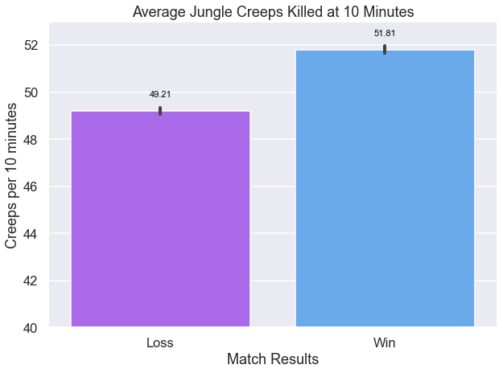

# Business Problem

Just like in any traditional sports, there are multiple elements  eSports there are many different aspects of a match that contribute to the outcome of either a win or a loss. This analysis focuses on using various machine learning algorithms to create a model based on data collected within the first 10 minutes of a high-ranking League of Legends match which as accurately as possible predicts the outcome of the match. Based on the resulting models, we will identify what elements of the game have the highest impact on the outcome of a match, and how an eSports coach should plan his/her team's training program.

# Data Understanding

The data we use to perform this analysis was obtained from [this](https://www.kaggle.com/bobbyscience/league-of-legends-diamond-ranked-games-10-min) Kaggle dataset which was obtained via the Riot API. It includes data from 9,879 high ranking (Diamond I to Master) competitive matches with 19 features per team and one target variable which indicates whether the match resulted in a win for the blue team.

<b>Glossary of Features:</b>
- Ward: An item that players can place on the map to reveal the nearby area. Very useful for map/objectives control.
- Assist: Awards partial gold and experience points when damage is done to contribute to an enemy's death.
- Dragon: AKA Drake. This powerful neutral monster grants various permanent effects and buffs when when killed by a team.
- Herald: A monster that spawns on the eighth minute. Grants a buff that allows the user to spawn the Herald for your team to help push towers and lanes.
- Tower: A structure that blocks the enemy’s path to the base. They take high damage and fire at opponents within a certain radius.
- Minions: Non-player characters (NPCs) that give experience upon death and gold to the player who scores the last hit.
- Jungle Minions: NPC that belong to NO TEAM. They give gold, experience and temporary buffs when killed by players.
- Gank: A surprise attack on an enemy champion usually coordinated and executed by the jungler or a roaming laner as well as the laner receiving the gank. Early gank attempts often try to catch the enemy champion off guard and kill them before they can reach the safety of their tower or teammates.

# Methods

In this analysis, we cover the following three model types:

1. Logistic Regression
2. Random Forest
3. XGBoost: Random Forest

Logistic Regression is the least computationally costly model, and so we  use this as a baseline to compare our other models and determine whether there is any value to using more complex models.

We then move onto Random Forest and XGBoost models to see whether an ensemble method might provide a better predictive model, while also keeping in consideration the issue of overfitting.

# Results
## Logistic Regression Coefficient Analysis

Using our final Logistic Regression and XGBoost models, we extract the feature coefficients and importances in order to identify how much impact each of the elements of the game are likely to have on the outcome of each match. Although the model with the best predictive ability was our baseline Logistic Regression model, we check feature importance with both the Logistic Regression and XGBoost that were run on df_select in order to compare how our models interpret our features.

    

    

According to our bar plot based on the Logistic Regression model, we see that champion kills and deaths within the first 10 minutes of the match have by far the most impact on the outcome of a match. We can see that total lane minions and total jungle creeps and dragons are also of high importance. Surprisingly, Heralds, vision wards, and towers are of least importance.

Because our displayed units are in odds, we can see that 1 standard deviation increase in each of the above features will result in the corresponding percent increase or decrease in the odds of winning.

## XGBoost Random Forest Feature Importance

Now we take a look at the feature importance rankings from our XGBoost model to compare to the size of coefficients found in our Logistic Regression Model.

    

    

## Individual Features vs. Win Rate

Now, let's take a look at what win rates we get against individual features that were either of high importance, or that we might have expected to be significant.

### Win or Loss vs Minions Killed at 10 minutes

    

    

We can see that there is a difference of approximately 10 in the number of total minions killed at the 10 minute mark that would make the difference between a loss and a win. In order to maximize our chances of winning, we want to make sure that the team reaches a total minion kill count of above 222 within 10 minutes of the match start.

### Win or Loss vs Jungle Minions Killed at 10 minutes

    

    

Although the difference in the total number of jungle creeps killed between losses and wins is smaller than we saw in the difference in lane minion kills, we want to make sure to have our jungler is able to clear more than 52 jungle creeps in order to maximize the odds of winning.

### Kill Count vs Win Rate

    

    

This bar plot indicates that there clearly does seem to be a correlation between the number of kills scored by the 10 minute mark and the likelihood of the match resulting in a win.

### Dragons vs Win Rate

    

    

We can see here again, that there is a large difference in win rate if the dragon is killed or not.

### Heralds vs Win Rate

    

    

Although there is a fairly large difference in the win rate between if the Rift Herald is killed or not, we know from our model's coefficients and importances that this aspect of the game is less of a priority compared to some other features previously discussed.

# CONCLUSIONS & RECOMMENDATIONS

Based on the above findings, we can see that champion kills and assists, lane minions, jungle minions, and dragons have the highest impact on the outcome of a high ranking League of Legends match.

My primary recommendation would be to focus heavily on the Jungler role. While optimizing an efficient jungle clearing path to maximize the number of jungle creeps killed, we want to make sure to capitalize on any early champion kills that might be possible if the Jungler can execute an effective gank.

My secondary recommendation would be to have all laners heavily drill last hitting minions to maximize the number of minion kills in the early stages of the match. There are a total of 107 minions that spawn per lane within the first 10 minutes of the match, and we want to aim for a team total of 222 minions or more. This means that each laner must kill at least 74 minions, while avoiding death and if possible, securing champion kills.

Lastly, since dragons are also of high importance, the Support role should place vision wards close to the dragon pit in order to maintain map control in that area, while the AD Carry role focuses on securing minions kills within his/her lane.

Some considerations for further analysis would include:
1. Whether we can find additional features outside of the scope of the selected dataset to improve the predictive capability of our models.
2. Analyzing data collected at the end of each match to identify what elements of the game led to a quicker vs. slower victory so that we can adjust the team strategy mid-game to increase the odds of winning.
3. Collect data on the specific eSports team's actual performance to identify what areas need to be targeted.

For the full in-depth analysis, please refer to my [Jupyter Notebook](https://www.kaggle.com/bobbyscience/league-of-legends-diamond-ranked-games-10-min) or feel free to contact me at [lee.hanjin@gmail.com](mailto:lee.hanjin@gmail.com) with any questions.